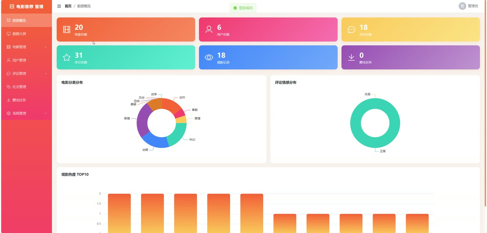
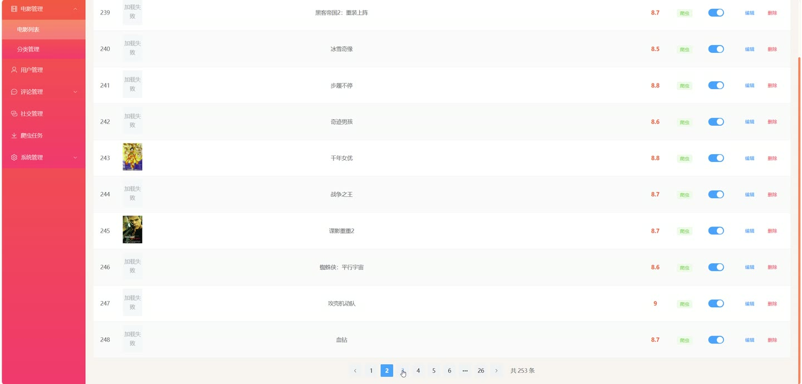

# (附文档)Springboot3+Vue3+MySQL 电影推荐系统

**技术栈**：Springboot3、Vue3、MySQL

### 系统简介

本系统是一个基于 Spring Boot 3 + Vue 3 + MySQL 架构的智能电影推荐平台，采用前后端分离模式。系统包含普通用户端和管理员端两大角色，提供电影浏览、智能推荐、社交互动、后台数据管理及爬虫数据采集等完整功能。
 
### 核心功能
 
### 普通用户端

 
- 注册/登录账号，支持用户名密码方式 
- 浏览电影列表，支持按关键词、分类、地区、上映年份筛选，仅显示已上架电影 
- 查看电影详情页，包含电影标题、封面、导演、演员、地区、上映年份、时长、简介、平均评分、评分人数及标签 
- 对电影进行评分（1-10分），系统自动更新该电影的平均评分与评分人数 
- 发布电影评论，系统调用情感分析接口自动标记评论为正面或负面情感并生成情感分数 
- 对他人评论进行点赞或取消点赞 
- 查看个人已发布的评论列表 
- 添加电影到“想看”列表，支持检查某电影是否已在想看列表中，以及移除想看记录 
- 添加电影到“已观”列表，支持检查某电影是否已观看，以及删除已观记录 
- 查看个人观影记录（已观列表）和想看列表 
- 接收个性化电影推荐（基于混合协同过滤算法，结合用户行为、内容相似度及情感分析） 
- 查看与当前电影相关的电影推荐（看过本片的人也看） 
- 查看与当前电影相关的志同道合用户列表 
- 关注/取消关注其他用户，查看关注列表与粉丝列表 
- 查看其他用户的主页（包含关注数、粉丝数及是否已关注状态） 
- 发送私信给其他用户，查看会话列表与聊天记录，支持标记消息已读及查看未读消息数 
- 查看个人资料及统计信息（关注数、粉丝数、已观数、想看数、评论数） 
- 修改个人资料（昵称、邮箱、手机号、性别、头像等） 
- 修改登录密码（需提供旧密码） 
- 查看个人收到的系统通知列表 
- 查看个人历史评分列表 
- 查看系统全体公告（首页跑马灯展示最新N条）
 
### 管理员端

 
- 登录后台管理系统 
- 查看数据可视化大屏，包含：电影总数、用户总数、评论总数、评分总数、观影记录总数、爬虫任务总数 
- 查看电影分类统计（各分类下的电影数量） 
- 查看评分趋势（按月统计评分数量） 
- 查看观影热度排行（热门电影TOP10） 
- 查看评论情感分布（正面/负面评论数量） 
- 查看用户活跃度（近7天每日操作数） 
- 查看爬虫数据统计（已完成/运行中/总任务数） 
- 查看评分排行TOP10电影 
- 管理电影信息：分页查询电影列表（支持关键词、分类、地区、年份筛选）、查看详情、新增/修改/删除电影、上架/下架电影 
- 管理电影分类：查看分类列表、新增/修改/删除分类（支持排序） 
- 管理电影标签：查看某电影的标签列表、保存标签（先删除旧标签再新增） 
- 导出电影数据为Excel（包含电影名称、导演、演员、地区、上映年份、评分、状态） 
- 管理用户：分页查询普通用户列表（支持关键词搜索）、查看用户详情、启用/禁用用户账号 
- 导出用户数据为Excel（包含用户名、昵称、邮箱、手机号、性别、状态、注册时间） 
- 管理评论：分页查询所有评论（支持关键词和情感筛选）、审核评论（隐藏/显示）、删除评论 
- 管理评分记录：分页查询评分列表（支持按电影ID或用户ID筛选） 
- 管理观影记录：分页查看所有已观记录、查看观影热度排行、删除记录 
- 管理想看记录：分页查看所有想看记录、删除记录 
- 管理爬虫任务：查看爬虫任务列表（支持关键词和状态筛选）、启动爬虫任务（指定任务名称和数据源，目前支持豆瓣）、停止运行中的爬虫任务、删除任务记录 
- 管理社交功能：查看用户关注关系、查看私信记录（支持关键词搜索）、删除违规私信 
- 管理系统日志：分页查看操作日志（支持关键词搜索）、删除单条日志、清空所有日志 
- 管理系统通知：分页查看通知列表（支持关键词搜索）、新增通知、删除通知 
- 管理个人信息：查看和修改管理员个人资料、修改登录密码
 
### 技术栈

 后端框架Spring Boot 3 ORMMyBatis-Plus 权限JWT Token 认证（基于请求头拦截） 前端框架Vue 3 状态管理Pinia 构建工具Vite 数据库MySQL 8 数据采集Jsoup（豆瓣爬虫） 情感分析百度智能云 NLP API 文件上传MultipartFile 本地存储 Excel导出Apache POI
 
### 交付内容

 
- 后端完整源码 
- 前端完整源码 
- 数据库初始化脚本 
- 万字文档

## 界面展示

---

## 获取完整源码 + 万字文档

本仓库为项目介绍页。**完整前后端源码、数据库初始化脚本、万字项目文档**，请访问 [codekk.top](http://codekk.top) 获取。

可作课程设计 / 毕业设计参考，支持远程部署调试。